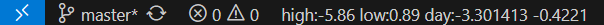

# 状态栏市场信息（Status Bar Market Info）

一个简洁的 VS Code 扩展，可以在状态栏实时显示市场数据。支持通过命令启动/关闭数据轮询，自动从金投网接口抓取并更新行情信息。



---

## ✨ 功能特色

- 一键开启或关闭状态栏行情显示
- 自动从金投网抓取最新市场数据
- 每 3 秒自动刷新一次
- 显示高/低价格差

---

## 🚀 安装方法

### 从本地安装（开发者使用）

1. 克隆或下载本仓库
2. 安装依赖并打包：

   ```bash
   npm install
   vsce package
## 🛠 使用方法

- Ctrl+Shift+P 打开命令面板
- 搜索并执行：Toggle Status Bar Info
- 第一次执行 → 显示状态栏并开始轮询更新
- 再次执行 → 停止轮询并隐藏状态栏
## 技术栈
- TypeScript

- VS Code 扩展 API

- Node.js 内置 https 模块